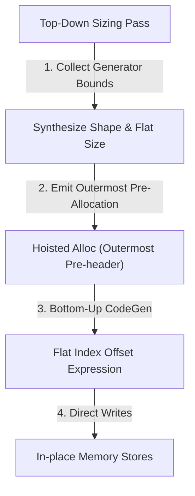

# Loop Flattening and Pre-Allocation Optimization Roadmap

This document outlines the compiler architecture, performance metrics, and the design roadmap for early array pre-allocation and loop-nest flattening optimizations in the Sisal compiler.

---

## 1. Architectural Strategy: "Malloc Early"

To achieve zero-allocation execution inside performance-critical loops, the compiler must minimize heap traffic by pre-allocating the final buffer space in the loop pre-header (`alloc` phase) rather than allocating dynamically inside the loop body.

### Comparison of Sizing Approaches

| Sizing Strategy | Static (Top-Down Walk) | Dynamic (`gather_store` / `catenate_store`) |
| :--- | :--- | :--- |
| **Mechanics** | A compile-time pass traverses nested loop generators to extract range sizes and compute the total flat dimension expression in the pre-header. | A runtime check on the first iteration (`gctr == 0`) extracts the dimensions of the first inner array element and allocates the flat buffer dynamically. |
| **Complexity** | High (requires dataflow tracing across subgraphs, conditional branches, and function boundaries). | Low (local to codegen, extremely robust). |
| **Heap Allocations** | **Exactly 1 malloc** (in the pre-header). | **Exactly 1 malloc** (on the first iteration). |
| **Fallback Path** | Not possible (must compile to standard boxing if static analysis fails). | Automatic (falls back to dynamic growth if element sizes vary across iterations). |

---

## 2. Timing and Performance Benchmarks

### Optimization 1: Loop Catenation (`returns value of catenate`)
*   **Benchmark:** Synthetic loop catenation of $N$ arrays of size $S$ ($N = 3000$, $S = 100$).
*   **Without Optimization (Dynamic Cat):** **170.83 ms** (and OOM-killed at $N=20000$ due to $O(N^2)$ memory copying).
*   **With Optimization (Catenate Store):** **0.299 ms** (**571× Speedup**, uses $O(N)$ flat memory).

### Optimization 2: Array-Valued Gathers (`returns array of X`)
*   **Benchmark:** `VSPHERE_DV` (shallow-water vertical integrals) processing a nested loop of $100,000$ grids ($N = 100,000$, $S = 12$).
*   **Without Optimization (`BOX-then-FLATTEN`):** **56.58 ms** (performed 100,002 mallocs).
*   **With Optimization (`gather_store`):** **41.52 ms** (**36.3% Speedup**, performed exactly 1 malloc for the outer gather).

---

## 3. Case Study: Cross Loop Gathers (`VSPHERE_DV`)

In `vsphere_dv.sis`, the outer loop is a `CROSS` generator:
```sisal
eg, pvg, pug, zvg, zug :=
    FOR hemi IN 1, 2 CROSS latlev IN 1, ilath
        % ... inner loop generates 1D arrays ...
```

### Static Pre-allocation Analysis:
1. The generator bounds `1, 2` and `1, ilath` are loop-invariant. The outer loop size is statically known to be `2 * ilath`.
2. The inner loop returns a 1D array of size `longitude_END * 2 + 2`. Since `longitude_END` is a function parameter, it is loop-invariant.
3. Therefore, the final gathered array is a flat 3D array of size `2 * ilath * (longitude_END * 2 + 2)`.
4. A top-down walk of the loop hierarchy can prove this shape is static and hoist the entire allocation into the outermost pre-header.

---

## 4. Design Roadmap: Two-Pass Loop Nest Flattening

For future compiler optimization passes, we propose a two-pass Loop-Nest Flattening optimizer:



1. **Top-Down Sizing Pass:** Recursively traverse loop generator bounds. Collect dimensions of nested loops and the inner-most array elements to synthesize a final shape and flat size expression.
2. **Pre-Allocation:** Emit a single `sisal_array_alloc_sized` in the outermost loop pre-header.
3. **Offset CodeGen:** Translate nested loop indices into a flat offset expression (`i * stride_i + j * stride_j + ...`) and emit direct memory writes, completely bypassing intermediate dope-vector structures.
