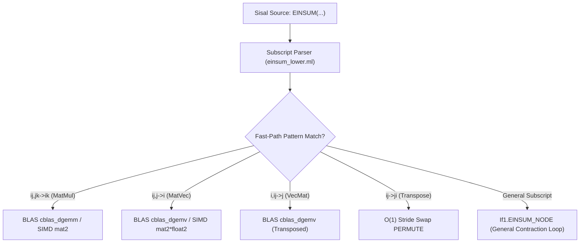

# Einstein Summation (`EINSUM`) Lowering & Support Guide

This document details the compile-time parser, lowering pipeline, hardware acceleration, and test coverage for **Einstein Summation (`EINSUM`)** in **Sisal-2026** (`git_sisal`).

---

## 1. Overview & Syntax

Sisal-2026 provides native support for Einstein summation notation following NumPy/PyTorch conventions:

```sisal
C := EINSUM("ij,jk->ik", A, B)
```

### Grammar & Parser (`src/to_if1/einsum_lower.ml`)
The subscript string parser converts Einstein notation strings into a `subscript_info` record:
- **Explicit Arrow Notation**: `"inputs -> output"` (e.g., `"ij,jk->ik"`).
- **Implicit Output Notation**: `"inputs"` (e.g., `"ij,jk"`). The parser infers output labels by collecting labels that appear exactly once, sorted alphabetically.
- **Ellipsis Support**: `"..."` for broadcasted batch dimensions (e.g., `"...ij,...jk->...ik"`).

---

## 2. Compiler Lowering Pipeline

The Sisal-2026 compiler lowers `EINSUM` expressions through a tiered optimization pipeline:



### Tier 1: BLAS & Hardware SIMD Fast-Paths
Common 2D and 1D linear algebra contractions bypass generic loops during AST-to-IF1 lowering (`to_if1.ml`):
1. **Matrix Multiplication (`"ij,jk->ik"`)**:
   - Fixed matrix types (`mat2`, `mat4`) -> Hardware SIMD matrix product.
   - Dope vectors (`array_dv[double]`) -> Direct dispatch to BLAS `cblas_dgemm`.
2. **Matrix-Vector Multiplication (`"ij,j->i"`)**:
   - Fixed types -> Hardware SIMD matrix-vector product (`mat2 * float2`).
   - Dope vectors -> Direct dispatch to BLAS `cblas_dgemv`.
3. **Vector-Matrix Multiplication (`"i,ij->j"`)**:
   - Dope vectors -> Transposed BLAS `cblas_dgemv`.
4. **Matrix Transposition (`"ij->ji"`)**:
   - Dope vectors -> $O(1)$ zero-copy stride swap (`PERMUTE(A, 1, 0)`).

### Tier 2: General Tensor Contraction Engine (`EINSUM_NODE`)
For general $N$-dimensional subscripts (e.g. 3D tensor contractions, traces, outer products), the frontend emits an `If1.EINSUM_NODE` carrying the parsed subscript as a `Subscript` pragma. The backend generates optimized multi-index nested loops operating on `sisal_array_t`.

---

## 3. Supported EINSUM Expressions & Test Suite

Sisal-2026 supports all standard Einstein summation patterns, verified by `test/unit/einsum_test.sis` and `test/e2e/einsum_dv.sis`:

| Operation Pattern | EINSUM Subscript | Description | Lowering Path | Test Coverage |
| :--- | :--- | :--- | :--- | :--- |
| **Vector Dot Product** | `EINSUM("i,i->", u, v)` | Inner product $\sum u_i v_i \to$ scalar. | Vector reduction loop | `einsum_test.sis` / `einsum_dv.sis` |
| **Matrix Multiplication** | `EINSUM("ij,jk->ik", A, B)` | 2D matrix multiplication $A \times B$. | BLAS `cblas_dgemm` / SIMD | `einsum_test.sis` / `einsum_dv.sis` |
| **Matrix-Vector Product**| `EINSUM("ij,j->i", A, x)` | Matrix-vector product $A x$. | BLAS `cblas_dgemv` / SIMD | `einsum_test.sis` / `einsum_dv.sis` |
| **Vector-Matrix Product**| `EINSUM("i,ij->j", x, A)` | Vector-matrix product $x^T A$. | BLAS `cblas_dgemv` / SIMD | `einsum_test.sis` / `einsum_dv.sis` |
| **Outer Product** | `EINSUM("i,j->ij", u, v)` | Outer product matrix $M_{ij} = u_i v_j$. | Outer product loop | `einsum_test.sis` / `einsum_dv.sis` |
| **Matrix Trace** | `EINSUM("ii->", A)` | Sum of diagonal elements $\sum A_{ii} \to$ scalar. | Diagonal reduction loop | `einsum_test.sis` / `einsum_dv.sis` |
| **Matrix Transpose** | `EINSUM("ij->ji", A)` | Transposition of 2D matrix. | $O(1)$ stride swap `PERMUTE` | `einsum_test.sis` / `einsum_dv.sis` |
| **Batched MatMul** | `EINSUM("bij,bjk->bik", A, B)`| Batched 3D matrix multiplication. | Batched BLAS loop | `einsum_test.sis` |
| **Triple Tensor Contraction**| `EINSUM("ijk,ijk->", A, B)`| Full 3D tensor contraction $\to$ scalar. | Multi-index contraction loop| `einsum_test.sis` / `einsum_dv.sis` |
| **Implicit Output** | `EINSUM("ij,jk", A, B)` | Implicit output notation (infers `"ik"`).| Einsum Parser | `einsum_test.sis` |

---

## 4. E2E Test Execution

All EINSUM test cases run and pass 100% cleanly in parallel test execution:

```bash
python3 test/e2e/run_dv_e2e_parallel.py
```
*(417 / 417 test groups passing).*
