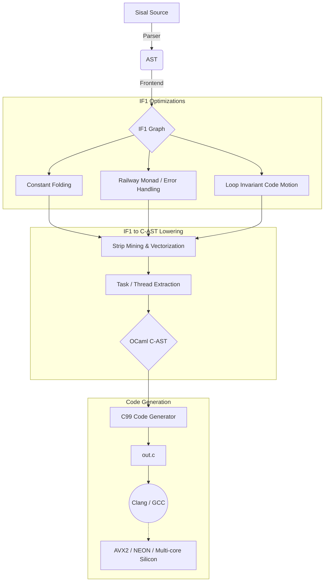
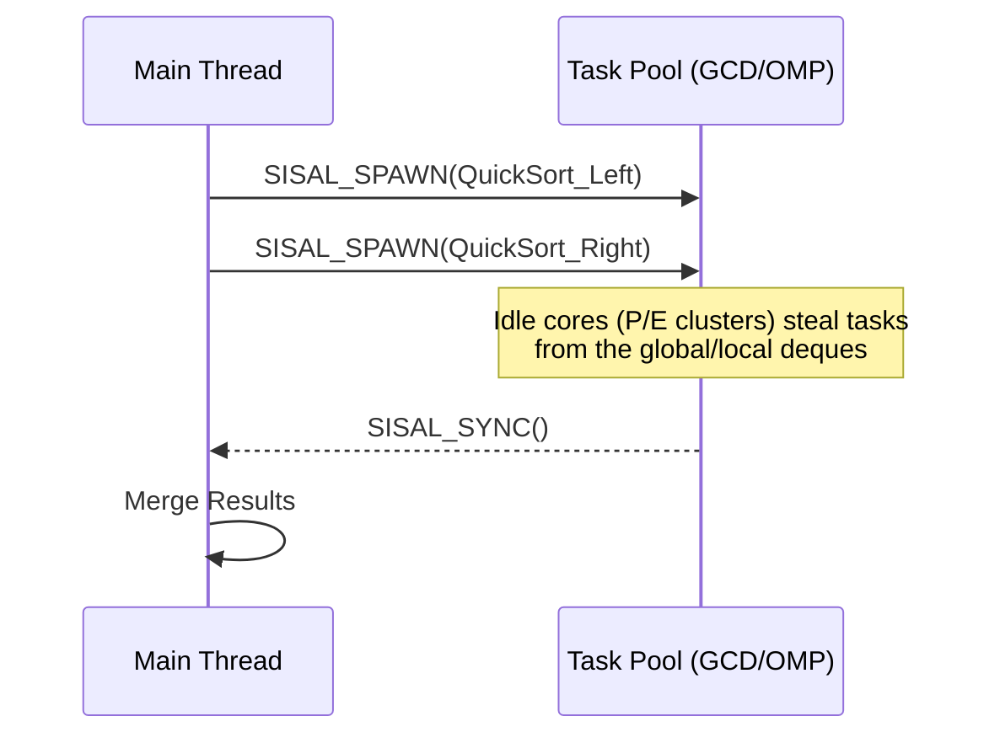

# IF1 to C-AST: The "First to Silicon" Architecture

This document outlines the architectural plan for lowering Sisal's IF1 intermediate representation to a modern, OCaml-native C Abstract Syntax Tree (C-AST). 

The primary goal of this bridge is **"First to Silicon"**—leveraging standard C compilers (Clang/GCC) to automatically map high-level parallel constructs to multi-core CPUs and SIMD units (AVX2, AVX-512, NEON) without the complexity of a raw assembly or LLVM IR backend.

---

## 1. High-Level Compiler Pipeline

The Sisal compiler pipeline transitions from the graph-based dataflow of IF1 to the structured, imperative control flow of C.



---

## 2. The OCaml C-AST Design

The Python-based `c_ast` is ported to a strongly-typed OCaml Algebraic Data Type (ADT). This ensures memory safety, pattern-matching capabilities, and seamless integration with the existing IF1 lowering passes.

Crucially, this ADT introduces **First-Class Pragmas** and **Vector Types** to support modern hardware.

```ocaml
(* docs/code_snippets/c_ast_types.ml *)

type qualifier = Const | Volatile | Restrict

type c_type = 
  | Basic of string                       (* e.g., "int", "float", "double" *)
  | Pointer of c_type * qualifier list    (* e.g., float *restrict *)
  | Array of c_type * int option          (* e.g., int a[10] *)
  | Vector of c_type * int                (* SIMD: __attribute__((vector_size(N))) *)
  | Struct of string * (string * c_type) list

type expr = 
  | Id of string
  | LitInt of int
  | LitFloat of float
  | BinOp of binary_op * expr * expr
  | Call of string * expr list
  | Deref of expr                         (* *ptr *)
  | AddrOf of expr                        (* &var *)
  | Index of expr * expr                  (* arr[i] *)
  | Cast of c_type * expr

type stmt = 
  | Decl of c_type * string * expr option
  | Expr of expr
  | For of stmt * expr * expr * stmt list
  | If of expr * stmt list * stmt list
  | Return of expr
  | Pragma of string                      (* e.g., "omp parallel for simd" *)
  | Compound of stmt list
```

---

## 3. Mapping IF1 to Silicon

### 3.1 Data Parallelism: The `FORALL` Node

Sisal's `FORALL` loops are embarrassingly parallel. The translation targets **OpenMP** for multi-threading across cores and **Clang Vector Extensions** for SIMD lane execution.

**Translation Strategy:**
1.  Identify the `FORALL` boundaries and reduction operators (e.g., `SUM`, `PRODUCT`).
2.  Emit a `Pragma("omp parallel for simd reduction(+:...)")`.
3.  Emit a standard `For` loop in the C-AST.

```mermaid
graph LR
    subgraph "IF1 Graph"
        A[FORALL Node] -->|Generator| B(1 .. N)
        A -->|Body| C(A[i] + B[i])
        A -->|Returns| D(ARRAY_OF)
    end
    
    subgraph "C-AST"
        E[Pragma: omp parallel for simd]
        F[For i = 1 to N]
        G[C[i] = A[i] + B[i]]
        E --> F
        F --> G
    end
    
    A ==> E
```

### 3.2 Task Parallelism: Recursion & `Let Rec`

GPU and strict SIMD models struggle with recursion. For CPUs, we utilize **Work-Stealing** deques to execute divide-and-conquer Sisal algorithms. To ensure performance on Apple Silicon and portability to Linux, we avoid Intel TBB and instead use a dual-backend approach.

**Translation Strategy:**
1.  Detect `Let_rec` or heavy function invocations.
2.  Emit a platform-agnostic `SISAL_SPAWN` and `SISAL_SYNC` macro.
3.  The runtime header (`sisal_task.h`) maps these to:
    *   **macOS:** Grand Central Dispatch (`dispatch_group_async`).
    *   **Linux/Windows:** OpenMP Tasks (`#pragma omp task`).



### 3.3 The "Railway Monad" in C

IF1 uses a "Railway Monad" to handle errors (e.g., Division by Zero, Out of Bounds) safely before executing a loop. In C, this maps to predicated execution or early exits.

*   **Scalar Context:** Translated to standard `if (error) { goto error_handler; }`.
*   **Vector Context (SIMD):** OpenMP/SIMD cannot easily `goto` out of a lane. The compiler must hoist the error check *outside* the SIMD loop or use **Masked Operations**.

```c
// Example of Hoisted Error Check generated by C-AST
int err = check_bounds(A, N);
if (err) return ERROR_OUT_OF_BOUNDS;

#pragma omp parallel for simd
for (int i = 0; i < N; i++) {
    // Safe to execute blindly in SIMD
    C[i] = A[i] / B[i]; 
}
```

---

## 4. Next Steps for Implementation

1.  **Initialize `src/c_ast/`**: Create the OCaml modules (`c_ast.ml`, `c_ast_print.ml`) for the ADT defined above.
2.  **The Lowering Pass (`src/to_c/`)**: Create a visitor that walks the IF1 graph and instantiates `c_ast` nodes.
3.  **Memory Model Definition**: Define how Sisal Arrays (and their dope vectors) map to C `structs` to ensure zero-copy views and efficient SIMD gathers.

---

## 5. Array Allocation & Copy Elimination — N-queens case study

Question examined: can a program (here, 8-queens) be written by fully
anticipating array extents and pre-allocating, under value semantics (no
in-place mutation; optimize only via reuse-after-last-use or partial update)?

Conclusion — split by which extents are knowable:

- **Per-board state is fully static.** `queen_vec` is a fixed `n`-slot dope
  vector; the per-column candidate array and validity mask are each exactly
  `n`; `in_check` reduces to a scalar. All compile-time-known.
- **Output extent and branching factor are not.** `COMPRESS` (valid-children
  count) and the `catenate`d solution set (the search's *answer*, 92 for n=8)
  are data-dependent. They can only be made static by worst-case padding
  (impractically loose) or by not materializing them.

The clean fully-static form is a **count/stream recursion** over the fixed
`queen_vec`: fold the branching into a scalar `value of sum`, drop `COMPRESS`
and `catenate`. The only array touched is the `n`-wide vector, and
`queens[col : row]` is a **single-element partial update** (prefix `1..col-1`
read-only, suffix still sentinel).

```
function Count(n, col : integer; queens : queen_vec returns integer)
  if col > n then 1
  else
    for row in 1, n
    returns value of sum
      if in_check(row, col, queens) then 0
      else Count(n, col+1, queens[col : row])
      end if
    end for
  end if
end function
```

**Storage bound under the optimization.** Each node's `n` candidates share one
scratch buffer (the parent has fanout `n`, but each child is consumed then
dead); DFS depth ≤ `n`. So the whole search needs an **`n × n` scratch** — one
`n`-vector per recursion level — independent of tree size. Pre-allocatable up
front, indexed by depth. This turns "a fresh copy at every tree node" into
`O(n²)` total live storage.

**Compiler gap.** This requires the (currently unbuilt) copy-elimination work —
always-copy is the present behavior, `ref_count` is inert. Specifically:
1. **fanout / last-use–gated in-place reuse** along the DFS spine (reuse the
   parent buffer when its refcount drops to 1), and
2. **partial-write recognition** of `a[i : v]` (single-element replace whose
   producer prefix is read-only) so it does not copy the untouched span.

The one extent that stays irreducibly dynamic is "return every solution board
as one array" — that is the search's output, unknowable a priori.
